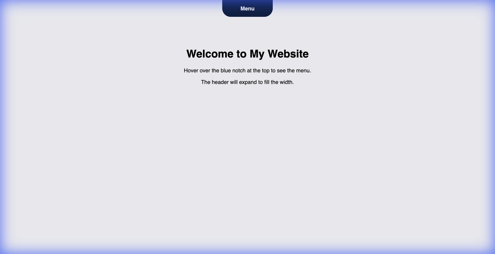
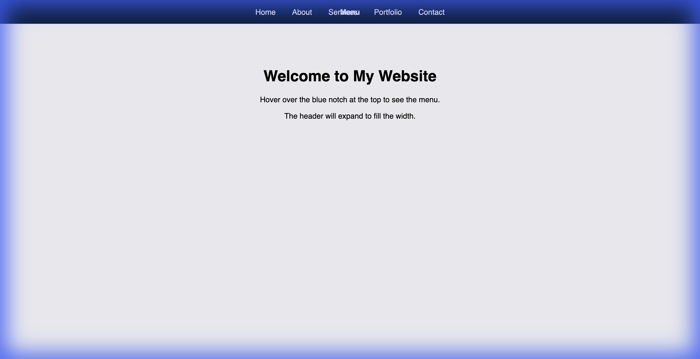

# Website Notch Menu

A simple, interactive website header that mimics a phone notch. It starts as a blue pill-shaped "notch" and smoothly expands into a full navigation menu on hover.

## Features
*   **Pure CSS Interaction**: No JavaScript required for the main effect.
*   **Smooth Transitions**: Fluid animation from notch to full header.
*   **Responsive**: Centers perfectly at the top of the page.

## Screenshots

### Default State (Collapsed)

### Hover State (Expanded)

## Usage
Simply open `index.html` in your web browser. Hover over the top blue bar to see the menu.